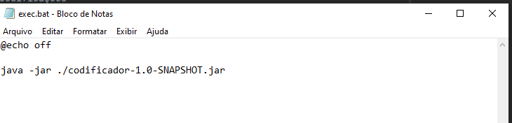
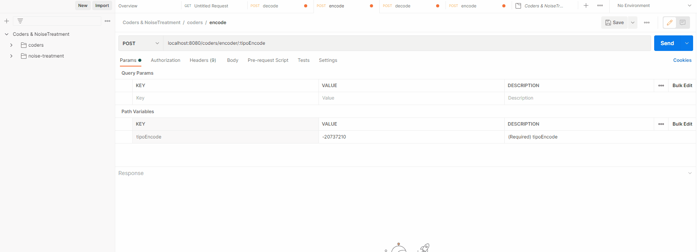

# TRABALHO GA - TEORIA DA INFORMAÇÃO

## MEMBROS: Kevin Lima, Pedro Henrique Gomes Viegas e Matheus Rocha

Como Rodar a aplicação:

Dentro da pasta executor, rodar o **exec.bat**
Que contem a seguinte instrução:

ou 

Abrir o projeto e rodar a classe **Coders.java**

---

Com o serviço funcionando, abrir a collection:

em **collection/Coders & NoiseTreatment.postman_collection.json**

ou acessar a url: http://localhost:8080/swagger-ui.html#/

## Coders

Para os acessos do Coders: Golomb, Elias-Gamma, Fibonacci, Unária e Delta

Para mandar a requisição:
-

Todas as requisições são chamadas POST
-

http://localhost:8080/coders/encoder/:tipoEncode

Encoder
-
Via Path passar o tipo de codificação que ser empregada

Via header
file -> onde é o path absoluto do arquivo a ser encodado

Decoder
-

http://localhost:8080/coders/decoder

Via header
file -> onde é o path absoluto do arquivo a ser decodado

## Tratamento de Ruido

Encoder: 
-

http://localhost:8080/noise-treatment/encoder

Via header
file -> onde é o path absoluto do arquivo a ser encodado

Decoder: 
-
http://localhost:8080/noise-treatment/decoder

Via header
file -> onde é o path absoluto do arquivo a ser decodado

# Informações da implentação

#### T1 - Codificações Golomb, Elias-Gamma, Fibonacci, Unária e Delta

Foi feita a sepação de coders eles irão ter sempre a implementação de um encoder e um decoder.

Para a codificação/decodificação Fibonacci: 
-
utilizou-se o valor ASCII 235 para representar o valor 0,
pois Fibonnaci não consegue empregar corretamente o valor 0.

Foi empregado nas decodificações/codificações: 
-
Delta - foi utilizado apenas operações BitSet

Fibonacci - apenas operações bitwise

Golumb - foi Utilizado BitSet e operações bitwise

Unary - foi Utilizado operações bitwise

Elias Gamma - foi Utilizado operações bitwise e BitSet

## Referencias

#### Bitwise Java - https://www.geeksforgeeks.org/bitwise-operators-in-java/
#### Logbase 2 java - https://www.techiedelight.com/calculate-log-base-2-in-java/
#### BitSet To Array byte - https://www.javatpoint.com/post/java-bitset-tobytearray-method
#### BitWise operator - https://www.javatpoint.com/bitwise-operator-in-java
#### BitWise Docs -https://docs.oracle.com/javase/7/docs/api/java/util/BitSet.html

# Implementação do T2 

## Tratamento de Ruídos - Hamming

Informações sobre a implementação
-

## CRC 8
  
  Nos 2 primeiros bits do cabeçalho é calculado o CRC8.
  Para o calculo foi utilizado código pronto encontrado na internet pelos integrantes do Grupo o nome da Classe é **CRC8** e está com seus direitos marcados.

  Quando não for possivel fazer a decodificação dos valores será retornado uma Exceção do tipo **InvalidCRCException**.

## Hamming

  O codigo hamming é calculado para o restante dos bites de entrada. 

  Foi Utilizado BitSet já que tem rapido acesso aos bites para conversão e tambem pela facil adptação do grupo ao seu uso.

Obs:
-
Não foi implementada uma validação para a extensão dos arquivos.

