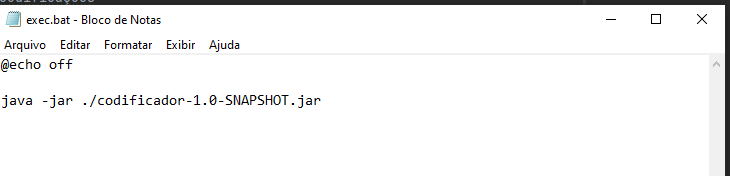
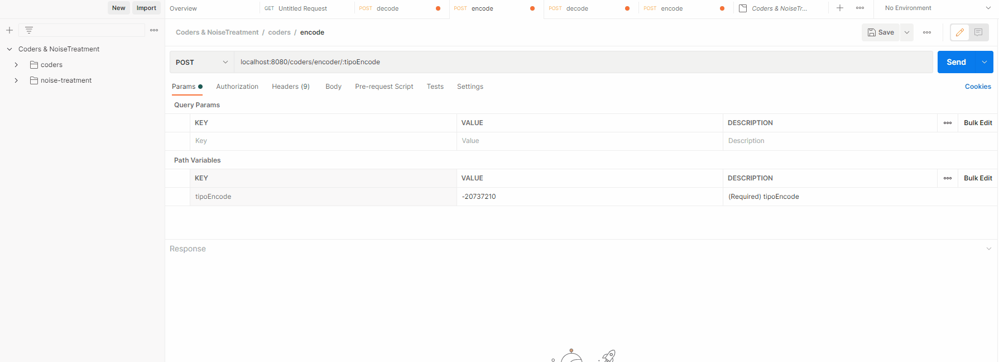

TRABALHO GA - TEORIA DA INFORMAÇÃO
MEMBROS: Kevin Lima, Pedro Henrique Gomes Viegas e Matheus Rocha

Como Rodar a aplicação:

Dentro da pasta executor, rodar o **exec.bat**
Que contem a seguinte instrução:

ou 

Abrir o projeto e rodar a classe **Coders.java**

---

Com o serviço funcionando, abrir a collection:

em **collection/Coders & NoiseTreatment.postman_collection.json**

ou acessar a url: http://localhost:8080/swagger-ui.html#/

Para os acessos do Coders: Golomb, Elias-Gamma, Fibonacci, Unária e Delta

Para mandar a requisição:
-
Via Path

T1 - Codificações 
